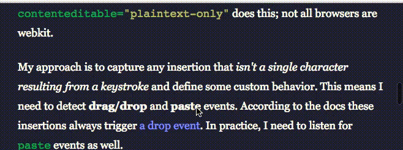

# header-hider

## Hide the header when the user is readin'

A very light-weight javascript plug in that finds the `<header>` on a page and hides it when the user scrolls down, then reveals it when the user scrolls up.

Works by setting and removing a negative `margin-top` on the `<header>`.




## to use

just include the script:

```
<script src="https://raw.githubusercontent.com/davidbstein/header-hider/master/header-hider.min.js"></script>
```

or 

```
<script src="/path/to/header-hider.min.js"></script>
```
